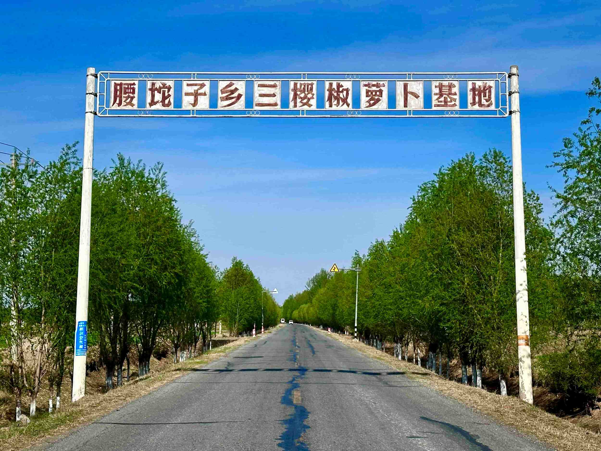

<div align="center">


<br />


<p>
  
  
  
  
</p>

一款围绕萝卜咸菜品牌展示、产品溯源与 DIY 腌制教程打造的原生微信小程序。

[功能亮点](#-功能亮点) · [页面预览](#-页面预览) · [快速开始](#-快速开始) · [项目结构](#-项目结构)

</div>

---

## 🥕 项目简介

「包萝万象」以暖橙色视觉和轻量交互讲述萝卜与咸菜的故事。项目涵盖品牌首页、产品展示、产地与工艺溯源、DIY 腌制教程、品牌介绍及用户服务等内容，适合作为微信原生小程序的学习案例或农产品品牌展示模板。

## ✨ 功能亮点

- 🏠 **品牌首页**：品牌视觉、海报轮播与精选产品展示
- 🔍 **产品溯源**：从产地、原料、工艺到品控的四段式介绍
- 🫙 **产品中心**：袋装干萝卜丁、罐装萝卜咸菜和 DIY 腌制套组
- 📖 **详情展示**：产品图片预览、特点说明与食用方式
- 🧑‍🍳 **DIY 教程**：材料介绍、五步腌制流程与保存提示
- 🧭 **自定义导航**：五栏 TabBar，突出首页入口
- 💬 **用户服务**：意见反馈、加入我们、支持与通用设置
- 🎨 **视觉动效**：渐变背景、轮播图、呼吸动画与卡片交互

## 🖼️ 页面预览

<div align="center">
  
  
  
</div>

> 当前仓库使用品牌海报作为预览。欢迎补充真机截图或录屏 GIF，让项目展示更直观。

## 🛠️ 技术栈

| 技术 | 用途 |
| --- | --- |
| WXML | 页面结构 |
| WXSS | 页面样式与动画 |
| JavaScript | 页面逻辑与交互 |
| 微信小程序原生 API | 路由、缓存、剪贴板、图片预览等能力 |

项目无需安装 npm 依赖，导入微信开发者工具即可运行。

## 🚀 快速开始

### 1. 克隆项目

```bash
git clone <你的仓库地址>
cd 包萝万象
```

### 2. 导入开发者工具

1. 打开[微信开发者工具](https://developers.weixin.qq.com/miniprogram/dev/devtools/download.html)
2. 选择「导入项目」
3. 选择本项目根目录
4. 使用自己的小程序 AppID，或选择测试号
5. 点击「编译」即可预览

> 首次公开仓库前，建议检查 `project.config.json` 和 `project.private.config.json`，避免提交个人环境配置。

## 📁 项目结构

```text
包萝万象/
├── app.js                  # 全局逻辑与产品数据
├── app.json                # 页面、窗口与 TabBar 配置
├── app.wxss                # 全局样式
├── components/             # 公共组件
├── custom-tab-bar/         # 自定义底部导航
├── images/                 # Logo、海报与产品图片
├── pages/                  # 小程序页面
│   ├── splash/             # 启动页
│   ├── index/              # 首页
│   ├── brand/              # 产品溯源
│   ├── products/           # 产品列表
│   ├── product-detail/     # 产品详情
│   ├── diy/                # DIY 教程
│   ├── mine/               # 品牌与服务入口
│   └── ...
├── utils/                  # 工具函数
└── project.config.json     # 微信开发者工具配置
```

## 🤝 参与贡献

欢迎提交 Issue 和 Pull Request：

1. Fork 本仓库
2. 创建功能分支：`git checkout -b feature/your-feature`
3. 提交修改：`git commit -m "feat: add your feature"`
4. 推送分支：`git push origin feature/your-feature`
5. 发起 Pull Request

## 📄 开源协议

本项目基于 [Apache License 2.0](./LICENSE) 开源，使用、修改和分发时请遵守许可证条款。

---

<div align="center">

如果这个项目对你有帮助，欢迎点亮 ⭐ Star。

**包萝万象 · 匠心承味 · 全程可溯**

</div>
